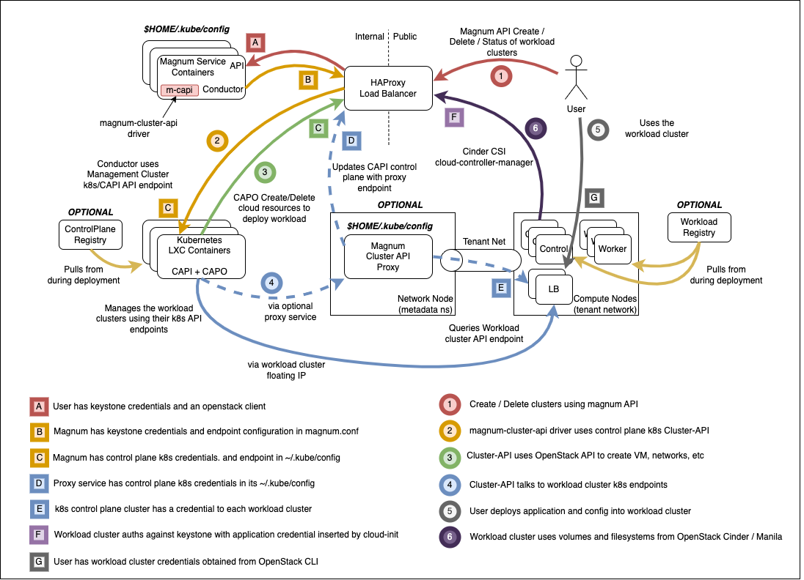

Vexxhost Magnum Cluster API driver
#####################################

About
-----

Magnum can be deployed with support for the Kubernetes Cluster API
using this repository. This page describes the Vexxhost Magnum Cluster API
driver.

The role builds upon a control plane Kubernetes cluster which is instantiated
during the OSA setup-infrastructure stage, adding driver support into Magnum.

The following architectural features are present:

* The control plane k8s cluster is an integral part of the openstack-ansible
  deployment, and forms part of the foundational components alongside mariadb
  and rabbitmq.
* The control plane k8s cluster is deployed on the infra hosts and integrated
  with the haproxy loadbalancer and OpenStack internal API endpoint, and not
  exposed outside of the deployment
* SSL is supported between all components and configuration is
  possible to support different certificate authorities on the internal
  and external loadbalancer endpoints.
* Control plane traffic can stay entirely within the management network
  if required
* The magnum-cluster-api-proxy service is deployed to allow communication
  between the control plane and workload clusters when a floating IP is not
  attached to the workload cluster.

* It is possible to do a completely offline install for airgapped environments

The magnum-cluster-api driver for magnum can be found here
https://github.com/vexxhost/magnum-cluster-api

Documentation for the Vexxhost magnum-cluster-api driver is here
https://vexxhost.github.io/magnum-cluster-api/

The ansible collection used to deploy the controlplane k8s cluster is here
https://github.com/adriacloud/ansible-collection-kubernetes

The ansible collection used to deploy the container runtime for the
controlplane k8s cluster is here
https://github.com/vexxhost/ansible-collection-containers

**These playbooks require Openstack-Ansible Flamingo or later. An earlier
version was provided in the openstack-ansible-ops repository**

Highlevel overview of the Magnum infrastructure these playbooks will
build and operate against.

Pre-requisites
--------------

* An existing openstack-ansible deployment
* Control plane using LXC containers, bare metal deployment is not tested
* Core openstack services plus Octavia

OpenStack-Ansible Integration
-----------------------------

.. note:
   The example configuration files shown below are suitable for use with an
   openstack-ansible All-In-One (AIO) build.

OpenStack-Ansible configuration for magnum-cluster-api driver
^^^^^^^^^^^^^^^^^^^^^^^^^^^^^^^^^^^^^^^^^^^^^^^^^^^^^^^^^^^^^

Define the physical hosts that will host the controlplane k8s cluster in
/etc/openstack_deploy/conf.d/k8s.yml. This example is for an all-in-one
deployment and should be adjusted to match a real deployment with multiple
hosts if high availability is required.

.. literalinclude:: assets/k8s.yml
   :language: yaml

You can set config-overrides for the control plane of the k8s cluster in
`/etc/openstack_deploy/group_vars/k8s_all/main.yml`.

.. literalinclude:: assets/k8s-config.yml
   :language: yaml

Next, set up config-overrides for the magnum service in
`/etc/openstack_deploy/group_vars/magnum_all/main.yml`. You should ensure
suitable images are uploaded for tenants' k8s cluster hosts.

Attention must be given to the SSL configuration. Users and workload clusters
will interact with the external endpoint and must trust the SSL certificate.
The magnum service and cluster-api can be configured to interact with either
the external or internal endpoint and must trust the SSL certificiate.
Depending on the environment, these may be derived from different certificate
authorities.

.. literalinclude:: assets/magnum-config.yml
   :language: yaml

Run the deployment
------------------

For a new deployment
^^^^^^^^^^^^^^^^^^^^

Run the OSA setup playbooks as usual, following the normal deployment guide.

For an existing deployment
^^^^^^^^^^^^^^^^^^^^^^^^^^

Create the k8s control plane containers

  .. code-block:: bash

     openstack-ansible openstack.osa.containers_lxc_create --limit k8s_all

Run the magnum-cluster-api deployment

  .. code-block:: bash

     openstack-ansible openstack.osa.k8s

Add the magnum-cluser-api driver to the magnum service

  .. code-block:: bash

     openstack-ansible openstack.osa.magnum

Optionally run a functional test of magnum-cluster-api
------------------------------------------------------

TODO: This is currently available to zuul CI only

Use Magnum to create a workload cluster
---------------------------------------

Upload Images

Create a cluster template

Create a workload cluster

Optional Components
-------------------

Use of magnum-cluster-api-proxy
^^^^^^^^^^^^^^^^^^^^^^^^^^^^^^^

As the control plane k8s cluster need to access a k8s control plane of tenant
cluster for it's further configuration, the only way to do it out of the box
is through the public network (Floating IP). This means, that API of the k8s
control plane must be globally reachable, which posses a security threat to
such tenant clusters.

On order to solve the issue and provide access for the control plane k8s
cluster to tenant clusters inside their internal networks a proxy service
is introduced.

#.. image:: assets/magnum_capi_proxy.drawio.png
#    :scale: 100 %
#    :alt: Cluster Network Connectivity
#    :align: center

Proxy service must be spawned on hosts, where Neutron Metadata agents are
spawned. For LXB/OVS these are members of ``neutron-agent_hosts``, while
for OVN the service should be installed to all ``compute_hosts``
(or ``neutron_ovn_controller``).

The service will configure own HAProxy instance and create backends
for managed k8s clusters to point inside corresponding network
namespaces.
Service does not spawn own namespaces, but leverages already existing
metadata namespaces to get connection to the Load Balancer inside
the tenant network.

Configuration of the service is relatively trivial:

   .. code-block:: yaml

      # Define a group of hosts where to install the service.
      # OVN: compute_hosts / neutron_ovn_controller
      # OVS/LXB: neutron_metadata_agent
      mcapi_vexxhost_proxy_hosts: compute_hosts
      # Define address and port HAProxy instance to listen on
      mcapi_vexxhost_proxy_environment:
         PROXY_BIND: "{{ management_address }}"
         PROXY_PORT: 44355

Also, in case of proxy service deployment, ensure that variable
``magnum_magnum_cluster_api_git_install_branch`` is defined
for the ``mcapi_vexxhost_proxy_hosts`` as well, or align value of the
``magnum_magnum_cluster_api_git_install_branch`` with
``mcapi_vexxhost_proxy_install_branch`` to avoid conflicts caused by different
versions of driver used.

Once configuration is complete, you can run the playbook:

   .. code-block:: bash

      openstack-ansible osa_ops.mcapi_vexxhost.mcapi_proxy

Deploy the workload clusters with a local registry
^^^^^^^^^^^^^^^^^^^^^^^^^^^^^^^^^^^^^^^^^^^^^^^^^^

TODO - describe how to do this

Deploy the control plane cluster from a local registry
^^^^^^^^^^^^^^^^^^^^^^^^^^^^^^^^^^^^^^^^^^^^^^^^^^^^^^

TODO - describe how to do this

Troubleshooting
---------------

Local testing
-------------

An OpenStack-Ansible all-in-one configured with Magnum and Octavia is
capable of running a functioning magnum-cluster-api deployment.

Sufficient memory should be available beyond the minimum 8G usually required
for an all-in-one. A multinode workload cluster may require nova to boot
several Ubuntu images in addition to an Octavia loadbalancer instance. 64G
would be an appropriate amount of system RAM.

There also must be sufficient disk space in `/var/lib/nova/instances` to
support the required number of instances - the normal minimum of 60G
required for an all-in-one deployment will be insufficient, 500G would
be plenty.

